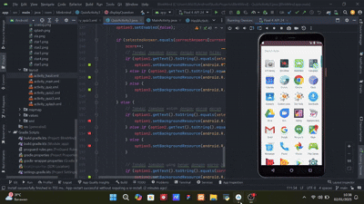

# App Quiz BlinkMind
BlinkMind adalah sebuah aplikasi kuis interaktif yang bertemakan bahasa pemrograman seperti C++, Java, dan Python. Aplikasi ini dirancang untuk menguji pengetahuan coding Anda melalui berbagai pertanyaan menantang, dan meningkatkan pemahaman Anda tentang syntax coding dalam dunia pemrograman.

 

| Variable           |             Isi            |
| -------------------|----------------------------|
| **Nama**           |         Fadil Aditya Adzima    |
| **NIM**            |          312310617         |
| **Kelas**          |          TI.23.A.6         |
| **Mata Kuliah**    |      Pemrograman Mobile 1     |
| **Dosen Pengampu** | Donny Maulana, S.Kom., M.M.S.I.  |

  

Aplikasi BlinkMind adalah aplikasi kuis interaktif yang dirancang untuk membantu pengguna meningkatkan pengetahuan dan keterampilan mereka dalam pemrograman. Berikut adalah beberapa fitur utama dari aplikasi ini :

# $${\color{lightblue}StoryBoard}$$
 

    

1. **Pilihan Kategori Kuis**  
   - Pengguna dapat memilih kategori kuis berdasarkan bahasa pemrograman, seperti **C++**, **Java**, dan **Python**. Setiap kategori memiliki ikon unik untuk memudahkan pengguna mengenali topik yang diinginkan. Fitur ini memungkinkan pengguna untuk fokus belajar pada bahasa pemrograman tertentu sesuai kebutuhan mereka. 

2. **Kuis Interaktif dengan Beragam Pertanyaan**  
   - Setiap kategori kuis berisi berbagai pertanyaan yang dirancang untuk menguji pengetahuan dan pemahaman pengguna tentang topik yang dipilih. Format pertanyaan disajikan dengan pilihan ganda, sehingga memudahkan pengguna dalam memberikan jawaban dan meningkatkan keterlibatan mereka.

3. **Penilaian Jawaban Secara Langsung**  
   - Setelah pengguna memilih jawaban, aplikasi langsung memberikan feedback apakah jawaban tersebut benar atau salah. Fitur ini membantu pengguna untuk belajar dari kesalahan mereka secara real-time, sehingga mereka bisa memperbaiki pemahaman mereka tentang materi yang sedang dipelajari.

4. **Hasil dan Pencapaian**  
   - Setelah menyelesaikan kuis, pengguna akan diarahkan ke layar hasil yang menampilkan pencapaian mereka dengan pesan "Congratulations!" jika mereka berhasil. Hal ini memberikan apresiasi terhadap upaya pengguna dan mendorong mereka untuk terus belajar. Ada juga opsi untuk kembali ke layar utama, memungkinkan pengguna untuk memilih kategori lain atau mengulang kuis.

5. **Antarmuka Pengguna yang Sederhana dan Menarik**  
   - Desain antarmuka yang minimalis dengan warna-warna yang menenangkan dan font yang mudah dibaca membantu pengguna untuk fokus pada konten kuis tanpa gangguan. Tampilan yang bersih dan intuitif membuat pengalaman pengguna lebih nyaman.

6. **Motivasi dan Kutipan Inspiratif**  
   - Aplikasi ini menampilkan kutipan inspiratif di layar awal, seperti pada deskripsi logo. Kutipan ini mendorong pengguna untuk terus belajar, berpikir kreatif, dan menjadikan aplikasi ini sebagai sumber motivasi tambahan.

Secara keseluruhan, fitur-fitur pada aplikasi BlinkMind dirancang untuk memberikan pengalaman belajar yang menyenangkan, bermanfaat, dan interaktif bagi pengguna yang ingin memperdalam pengetahuan mereka dalam bidang pemrograman.

